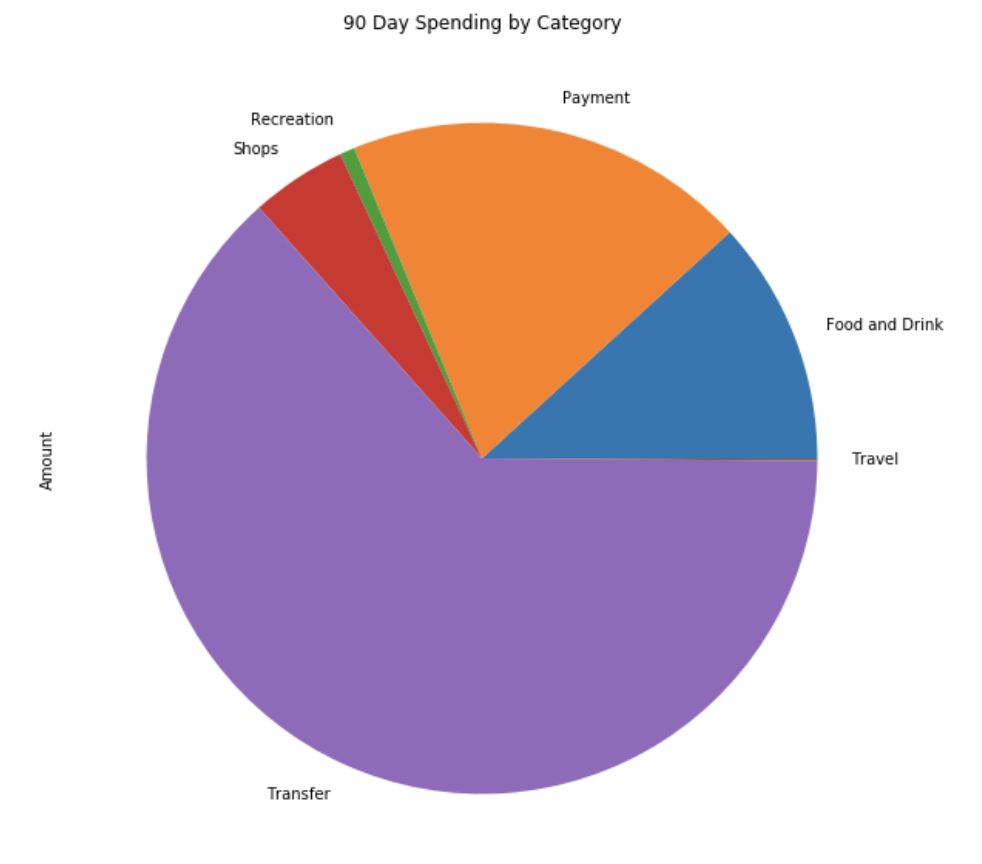
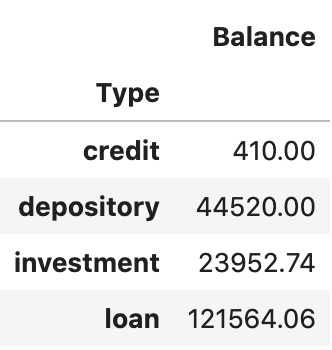
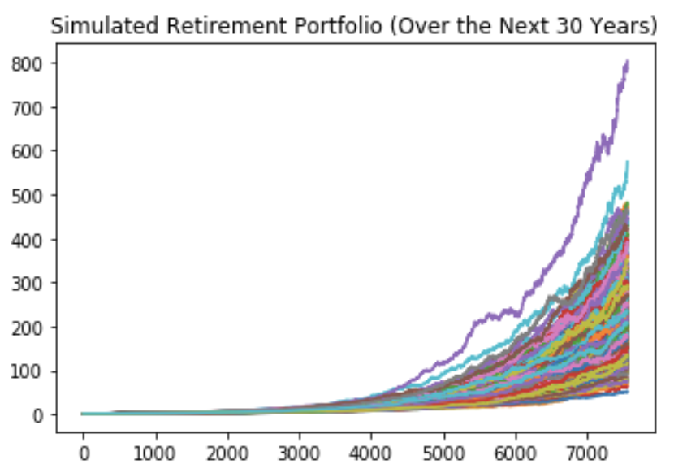
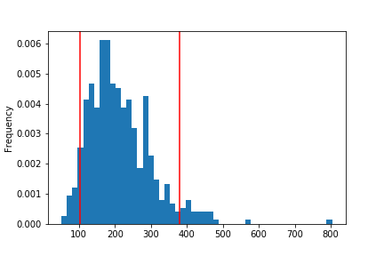
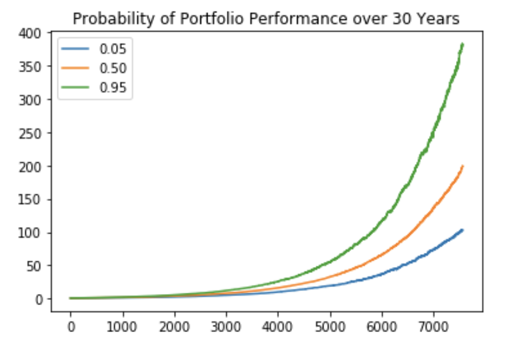
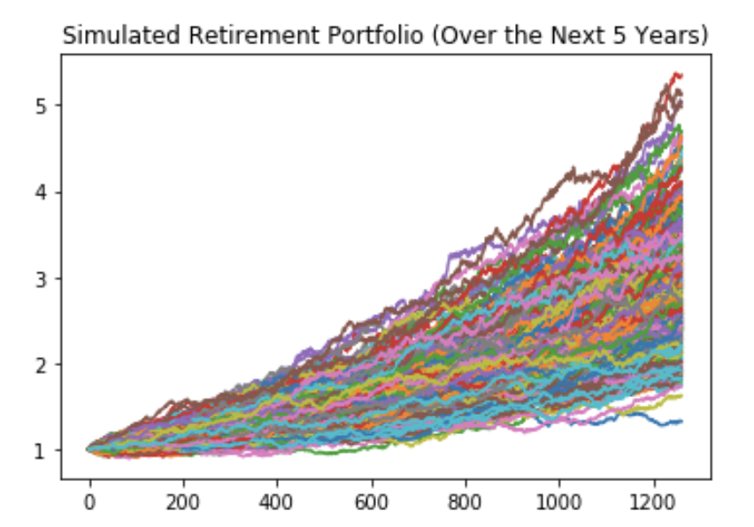
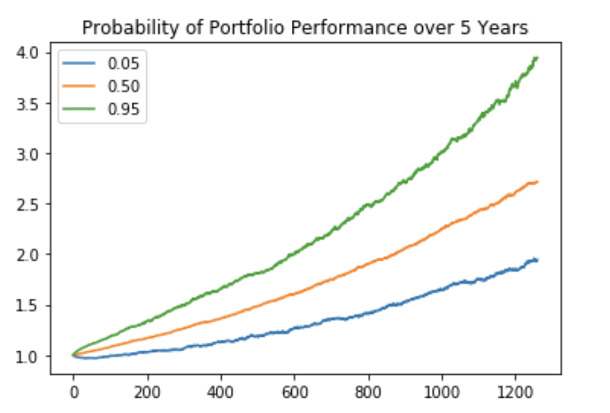

# Financial Report

## Background

Harold has tasked us with providing some budgeting and investing analysis for him to save for today and plan for his future. Taking the sample data sets provided by Plaid and creating a mix of stocks and bonds using Monte Carlo simulations, we've run our analyis and drawn some conclusions for Harold.

---

## Budget Analysis

### Expenses & Long Term Debt

We pulled transactional history for the last 90 days. The following pie chart show the expenses by category:

As you can see by the pie chart above, Harold's spending is skewed by all the transfers and payments he's making. We reviewed Harold's long term liabilities. He has both a mortgage and student loans to repay, which we believe are included in his transfers and payments.

### Income & Assets

We discovered Harold had one income stream, his job at United Airlines. 

Harold's last year's annual income (before taxes) was $7,285.

Current year's annual income (before taxes) is projected to be $7,389.

As we noted in the expenses section, Harold's transfers and payments need to be analyzed further to see if Harold is living within his means.

On the bright side, Harold does have a healthy next egg set aside in both his 401K and his money market accounts.

---

## Retirement Planning

After reviewing Harold's budget analysis, we did a couple of simulations based on a stochastic model of random predictions.

### Portfolio Analysis - 30 Years, $20,000 Investment

Our initial simulation was based on 30 years until retirement, with an initial investment from Harold's current 401K of $20,000. The portfolio would consist of a mix of 60% stocks and 40% bonds.

Given the above graph, Harold's ending returns would likely fall within our confidence interval of 90% below.

Assuming that Harold's retirement portfolio was in the lower 10th percentile and he would withdraw 4% annually to maintain his principal in his retirement account, Harold would be able to live comfortably on his annual retirement income of $96,021.99.

Harold's Retirement Portfolio would likely fall within the parameters of the above graph. 

### Portfolio Analysis - 5 Years, $60,000 Investment

Harold is toying with the idea of retiring in 5 years. With this in mind, we had to change our assumptions and be a little more aggressive in our portfolio, with a mix of 75% stocks and 25% bonds.

Staying within a 90% confidence interval, we found that with an initial investment of $60,000, Harold could retire in 5 years.

Harold would be able to withdraw $7,505.09 annually from retirement account annually and continue to live his current lifestyle.
